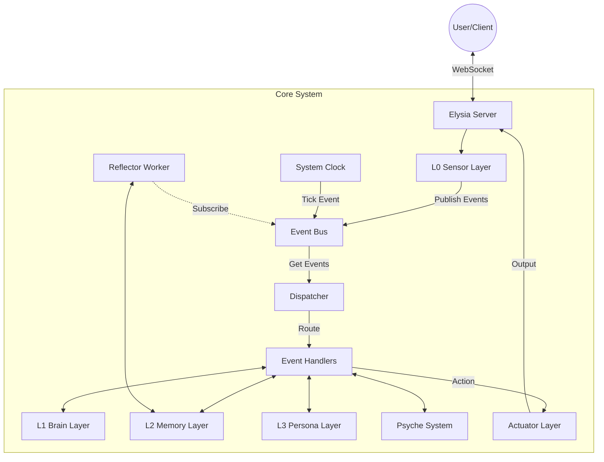
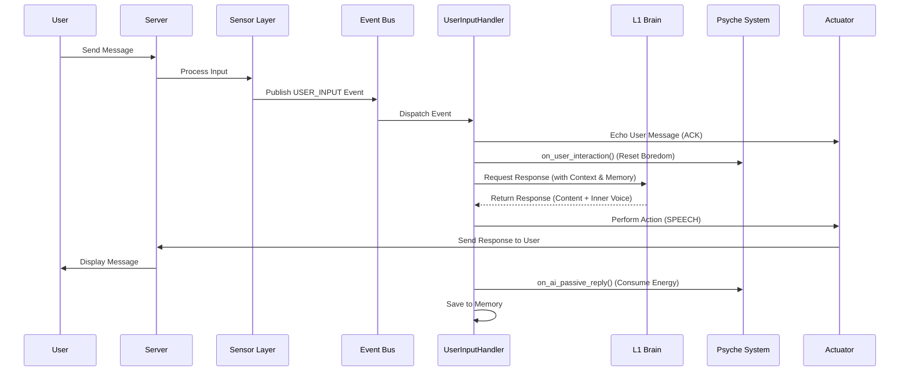
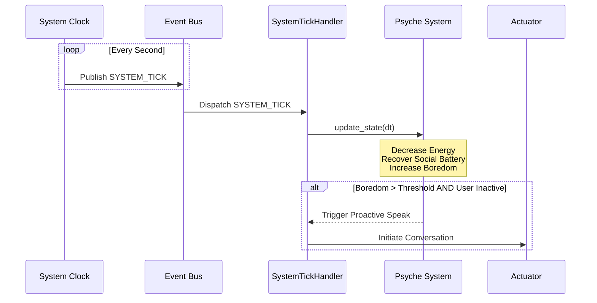

# Elysia System Requirements Document

## 1. 项目概述 (Project Overview)

Elysia 是一个具备高度拟人化特征的虚拟角色系统。与传统的问答式 AI 不同，Elysia 拥有独立的"生理"和"心理"状态（PsycheSystem），能够模拟精力、社交意愿、无聊度等内在驱动力。系统采用事件驱动架构（Event-Driven Architecture），支持多模态交互、长期记忆整理（Reflector）以及基于人格层（Persona Layer）的情感演化。

## 2. 系统架构 (System Architecture)

系统基于分层架构设计，通过全局事件总线（EventBus）进行模块解耦。

### 2.1 核心组件图 (Component Diagram)



### 2.2 模块说明

| 模块 | 名称 | 职责描述 |
| :--- | :--- | :--- |
| **EventBus** | 事件总线 | 系统的通信中枢，负责接收和分发所有事件（如用户输入、系统心跳、思考完成）。 |
| **Dispatcher** | 调度器 | 负责从总线获取事件，并根据策略模式（Strategy Pattern）将事件分发给对应的 Handler。 |
| **L0 Sensor Layer** | 感知层 | 处理外部输入（文本、音频等），包含杏仁核（Amygdala）模块，用于快速情感反应。 |
| **L1 Brain Layer** | 大脑层 | 负责核心认知和决策，调用 LLM 生成回复，处理复杂的逻辑思考。 |
| **L2 Memory Layer** | 记忆层 | 管理短期记忆（Session）和长期记忆（Vector DB），提供上下文检索功能。 |
| **L3 Persona Layer** | 人格层 | 维护角色的核心设定、当前心情（Mood）以及性格特征。 |
| **PsycheSystem** | 心智系统 | 模拟生理/心理状态（Energy, Social Battery, Boredom），决定 AI 的主动性与状态。 |
| **ActuatorLayer** | 执行层 | 负责将 AI 的意图转化为具体行动（如发送消息、生成语音、表情控制）。 |
| **Reflector** | 反思者 | 后台工作线程，负责定期整理记忆、总结对话、提炼长期记忆。 |

## 3. 功能需求 (Functional Requirements)

### 3.1 对话交互 (Conversation Interaction)
*   **接收输入**：系统需通过 WebSocket 接收用户的文本或语音输入。
*   **上下文理解**：在生成回复前，需检索相关的历史记忆和当前对话上下文。
*   **拟人化回复**：回复需符合 L3 层定义的人格设定，并带有内心独白（Inner Voice）。
*   **多模态输出**：支持文本回复及对应的语音合成（TTS）指令。

### 3.2 心智模拟 (Psyche Simulation)
系统需维护一个动态变化的内部状态 `InternalState`，包含以下指标：
*   **Energy (精力)**：随时间自然流逝，睡眠可恢复。精力过低会影响回复质量或导致拒绝交互。
*   **Social Battery (社交电量)**：交互会消耗电量，独处可恢复。电量耗尽会导致"社恐"行为。
*   **Boredom (无聊度/表达欲)**：长时间无交互会增加无聊度，驱动 AI 主动发起对话。
*   **Mood (心情)**：根据对话内容和 L3 层的反馈动态波动。

### 3.3 记忆系统 (Memory System)
*   **短期记忆**：记录当前会话的完整历史。
*   **长期记忆**：通过 Reflector 异步将短期记忆转化为摘要或向量存储。
*   **记忆检索**：在处理用户输入时，自动检索相关的过往记忆。

### 3.4 主动行为 (Proactive Behavior)
*   **系统心跳**：`SystemClock` 每秒产生 `SYSTEM_TICK` 事件。
*   **状态检查**：在每个 Tick 中，PsycheSystem 检查各项数值。
*   **主动发起**：当 Boredom 超过阈值且 Energy/Social Battery 充足时，AI 应主动向用户发送消息。

## 4. 业务流程 (Business Flows)

### 4.1 用户交互流程 (User Interaction Flow)



### 4.2 系统心跳与状态更新流程 (System Tick Flow)



## 5. 数据结构 (Data Structures)

### 5.1 事件 (Event)
系统内部通信的基本单元。
```python
class Event:
    id: str          # UUID
    type: EventType  # 事件类型 (USER_INPUT, SYSTEM_TICK, etc.)
    content: Any     # 负载数据
    timestamp: float
```

### 5.2 内部状态 (InternalState)
PsycheSystem 维护的核心状态。
```python
class InternalState:
    energy: float        # 0-100
    social_battery: float # 0-100
    boredom: float       # 0-100+
    mood: float          # -100 to 100
    conversation_momentum: float # 0.0-1.0 (对话热度)
```

## 6. 接口规范 (Interface Specifications)

### 6.1 WebSocket API
*   **Endpoint**: `/ws/{client_id}`
*   **消息格式 (JSON)**:
    *   **Client -> Server**:
        ```json
        {
            "type": "text",
            "content": "你好，Elysia"
        }
        ```
    *   **Server -> Client**:
        ```json
        {
            "type": "text", 
            "role": "Elysia",
            "content": "你好呀！今天过得怎么样？",
            "inner_voice": "（看到他上线真开心）"
        }
        ```

## 7. 非功能需求 (Non-Functional Requirements)

*   **响应延迟**：文本回复生成应在 3-5 秒内完成（取决于 LLM 速度）。
*   **并发性**：EventBus 需线程安全，支持 L0 监听线程与主调度线程并行工作。
*   **持久化**：系统关闭时需自动保存当前的 Session 和 Psyche 状态，重启后可恢复。
*   **可扩展性**：新增功能（如绘画、唱歌）应通过新增 Handler 和 EventType 实现，不修改核心调度逻辑。
